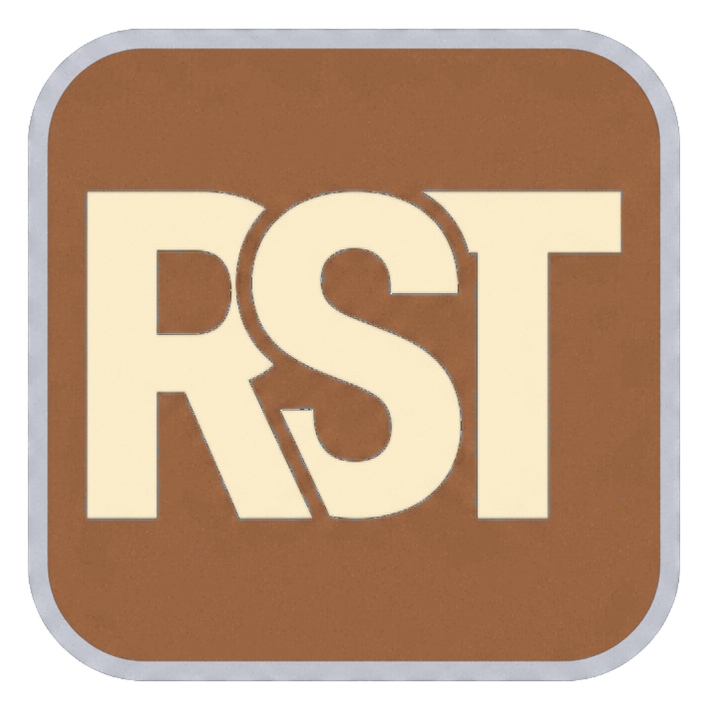

<p align="center"></p>

# RS3 Timers

A small Windows desktop app that tracks RuneScape 3 growth timers: farming patches and Player-owned farm animals. Add a timer, it counts down, and the app chimes and pops a tray notification when the thing is ready.

Built for one player's own use and shared as is. No login, no game hooks, no data leaves your PC.

## Download and run

1. Grab `RS3Tracker.exe` from the [Releases](../../releases) page.
2. Put it in a folder of its own. It saves your timers in a file next to itself.
3. Double click it.

The first launch shows the Windows SmartScreen warning ("Windows protected your PC"). That is what Windows says about any unsigned program from the internet. Click **More info**, then **Run anyway**. It only asks once.

The exe is about 66 MB because it carries its own .NET runtime, so nothing else needs installing.

## Using it

- **+ Add timer** opens a picker. Type to search, or choose a category and a thing. Farm animals let you pick how far to grow them (adolescent, adult, elder). The timer starts the moment you add it.
- Each row shows the name, a label box you can type your own note into (north patch, yak pen, whatever), the countdown, and when it will be ready.
- **Start** starts an idle or finished timer. It does nothing while a timer is running, so a stray click cannot restart one.
- **Reset** clears a running timer back to idle and asks you first. You can turn the confirmation off in Settings.
- **x** removes the row.
- Ready timers turn green, jump to the top, play a chime and show a tray balloon. They stay until you Start or remove them.
- Minimise sends the app to the tray next to the clock. Double click the tray icon or right click, Open to bring it back. Close quits, but your timers are saved and keep counting while the app is shut.
- The sun / moon button switches dark and light mode. The gear opens Settings: volume, mute, test sound, keep on top of the game, confirm on reset, and where your files live.

## Where things are saved

- `rs3tracker-state.json` next to the exe holds your timers and settings. If that folder is read only, it falls back to `%LocalAppData%\RS3Tracker`. Settings shows the path in use.
- End times are stored as UTC clock times, so reopening the app later shows the right remaining time.

## Changing or adding timers

The list of things you can track comes from `timers.json`, built into the exe. To change it without rebuilding, put a copy of [data/timers.json](data/timers.json) next to the exe (or in a `data` folder above it) and edit that. The app uses the external copy when it finds one.

Each category has a list of items. An item needs a `name` and either `minutes` (a plain countdown) or `stages` (cumulative targets, used for animals). `level` and `note` are optional and only shown in the picker.

```json
{ "name": "Potato", "minutes": 40, "level": 1, "note": "4 cycles of 10 min" }
```

Growth times come from the RuneScape Wiki. Farming patches grow on a fixed game clock, so the real ready time can be up to one cycle later than the countdown.

## What it does not do yet

- Player-owned farm buyers (they reset on a fixed clock, not a countdown).
- Breeding timers.
- Anything that needs the game itself. If Jagex ever ships an API, timers could be started from it.

## Building from source

Requires the .NET 8 SDK on Windows.

```
dotnet build -c Release        # check it compiles
publish.cmd                    # produces dist\RS3Tracker.exe, single file, self contained
```

C# and WPF, no third party packages. `MainWindow` is the timer list, `AddTimerWindow` the picker, `SettingsWindow` the settings, `Storage` finds the catalog and state files, `Sound` generates the chime, `Theme` and `DarkTitle` handle dark and light mode.

## Licence

[PolyForm Noncommercial 1.0.0](LICENSE). Free to use, copy, change and share. Selling it or using it commercially needs the copyright holder's permission.

Copyright (c) 2026 signalbrycea.
